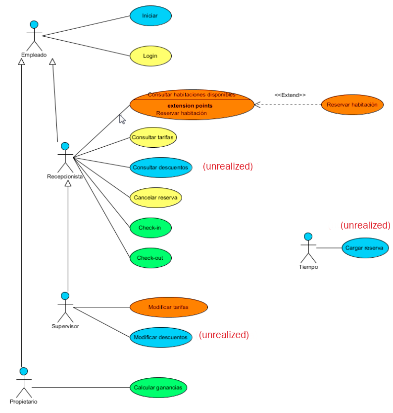

## Proyecto de Ingeniería del Software para la Web. Hotel de Habitaciones

Universidad de Valencia, Ingeniería de Servicios y Aplicaciones Web, Ingenería del software, 2016-17

___
Java EE application server: **GlassFish v.4.1.1**

You need to create the roles to gain access to the intranet management web application.

Glassfish admin console, default: http://localhost:4848/

*Configuration > server-config > Security > Realms > file*
and on page click *"Manage Users" > New* and add three roles (which are defined in /WEB-INF/glassfish-web.xml) with desired passwords:
+ recepcionista
+ supervisor
+ propietario

The Project Use Case diagram:
